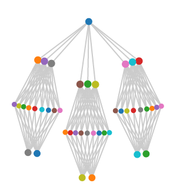

spigo
=====

Simulate Protocol Interactions in Go using nanoservice actors

Suitable for fairly large scale simulations, runs well up to 100,000 independent nanoservice actors. Two architectures are implemented. One creates a peer to peer social network (fsm and pirates). The other is based on NetflixOSS microservices in a more tree structured model.

Each nanoservice actor is a goroutine. to create 100,000 pirates, deliver 700,000 messages and wait to shut them all down again takes about 4 seconds. The resulting graph can be visualized via GraphML or rendered by saving to Graph JSON and viewing in a web browser via D3.

[](https://godoc.org/github.com/adrianco/spigo)

```
$ ./spigo -h
Usage of ./spigo:
  -a="fsm": Architecture to create or read, fsm or netflixoss
  -cpuprofile="": Write cpu profile to file
  -d=10:    Simulation duration in seconds
  -g=false: Enable GraphML logging of nodes and edges
  -j=false: Enable GraphJSON logging of nodes and edges
  -m=false: Enable console logging of every message
  -p=100:   Pirate population for fsm or scale factor % for netflixoss
  -r=false: Reload <arch>.json to setup architecture
  
$ ./spigo -a netflixoss -d 1 -j -p 200
2015/02/02 15:52:56 netflixoss: scaling to 200%
2015/02/02 15:52:56 logger: starting
2015/02/02 15:52:56 netflixoss: elb activity rate  100ms
2015/02/02 15:52:57 netflixoss: Shutdown
2015/02/02 15:52:57 netflixoss: Exit
2015/02/02 15:52:57 spigo: netflixoss complete
2015/02/02 15:52:57 Logger has 0 messages left to flush
2015/02/02 15:52:57 logger: closing

$ ./spigo -d 2 -j -p 10
2015/01/28 00:23:01 fsm: population 10 pirates
2015/01/28 00:23:01 logger: starting
2015/01/28 00:23:01 fsm: Talk amongst yourselves for 2s
2015/01/28 00:23:01 fsm: Delivered 60 messages in 968.09us
2015/01/28 00:23:03 fsm: Shutdown
2015/01/28 00:23:03 fsm: Exit
2015/01/28 00:23:03 spigo: fsm complete
2015/01/28 00:23:03 Logger has 0 messages left to flush
2015/01/28 00:23:03 logger: closing

$ ./spigo -d 2 -r
2015/01/28 00:23:20 fsm reloading from fsm.json
2015/01/28 00:23:20 Version:  spigo-0.3
2015/01/28 00:23:20 Architecture:  fsm
2015/01/28 00:23:20 Link Pirate7 > Pirate8
2015/01/28 00:23:20 Link Pirate7 > Pirate5
2015/01/28 00:23:20 Link Pirate1 > Pirate8
2015/01/28 00:23:20 Link Pirate1 > Pirate3
2015/01/28 00:23:20 Link Pirate2 > Pirate7
2015/01/28 00:23:20 Link Pirate4 > Pirate10
2015/01/28 00:23:20 Link Pirate4 > Pirate5
2015/01/28 00:23:20 Link Pirate8 > Pirate4
2015/01/28 00:23:20 Link Pirate8 > Pirate10
2015/01/28 00:23:20 Link Pirate9 > Pirate1
2015/01/28 00:23:20 Link Pirate9 > Pirate8
2015/01/28 00:23:20 Link Pirate10 > Pirate3
2015/01/28 00:23:20 Link Pirate10 > Pirate7
2015/01/28 00:23:20 Link Pirate3 > Pirate8
2015/01/28 00:23:20 Link Pirate5 > Pirate7
2015/01/28 00:23:20 Link Pirate5 > Pirate2
2015/01/28 00:23:20 Link Pirate6 > Pirate10
2015/01/28 00:23:20 Link Pirate6 > Pirate5
2015/01/28 00:23:22 fsm: Shutdown
2015/01/28 00:23:22 fsm: Exit
2015/01/28 00:23:22 spigo: fsm complete
```

NetflixOSS Architecture
-----------
Scaled to 200% with one ELB in the center, three zones with six Zuul and 18 Karyon each zone, rendered using GraphJSON and D3.


Scaled 100% With one ELB at the top, three zones with three Zuul, nine Karyon and two staash in each zone, rendered using GraphJSON and D3. [Run this in your browser by clicking here](http://rawgit.com/adrianco/spigo/master/netflixoss.html)



100 Pirates 
-----------
After seeding with two random friends GraphML rendered using yFiles


After chatting and making new friends rendered using graphJSON and D3


[Run spigo.html in your browser by clicking here](http://rawgit.com/adrianco/spigo/master/spigo.html)

Spigo uses a common message protocol called Gotocol which contains a channel of the same type. This allows message listener endpoints to be passed around to dynamically create an arbitrary interconnection network.

Using terminology from Promise Theory each message also has an Imposition code that tells the receiver how to interpret it, and an Intention body string that can be used as a simple string, or to encode a more complex structured type or a Promise.

There is a central controller, the FSM (Flexible Simulation Manager or [Flying Spaghetti Monster](http://www.venganza.org/about/)), and a number of independent Pirates who listen to the FSM and to each other.

Current implementation creates the FSM and a default of 100 pirates, which can be set on the command line with -p=100. The FSM sends a Hello PirateNN message to name them which includes the FSM listener channel for back-chat. FSM then iterates through the pirates, telling each of them about two of their buddies at random to seed the network, giving them a random initial amount of gold coins, and telling them to start chatting to each other at a random pirate specific interval of between 0.1 and 10 seconds.

FSM can also reload from a json file that describes the nodes and edges in the network.

Either way FSM sleeps for a number of seconds then sends a Goodbye message to each. The Pirate responds to messages until it's told to chat, then it also wakes up at intervals and either tells one of its buddies about another one, or passes some of it's gold to a buddy until it gets a Goodbye message, then it quits and confirms by sending a Goodbye message back to the FSM. FSM counts down until all the Pirates have quit then exits.

The effect is that a complex randomized social graph is generated, with density increasing over time. This can then be used to experiment with trading, gossip and viral algorithms, and individual Pirates can make and break promises to introduce failure modes. Each pirate gets a random number of gold coins to start with, and can send them to buddies, and remember which benefactor buddy gave them how much.

Simulation is logged to a file spigo.graphml with the -g command line option or <arch>.json with the -j option. Inform messages are sent to a logger service from the pirates, which serializes writes to the file. The graphml format includes XML gibberish header followed by definitions of the node names and the edges that have formed between them. Graphml can be visualized using the yEd tool from yFiles. The graphJSON format is simpler and Javascript code to render it using D3 is in spigo.html.

There is a test program that exercises the Namedrop message, this is where the FSM or a Pirate passes on the name of a third party, and each Pirate builds up a buddy list of names and the listener channel for each buddy. Another test program tests the type conversions for JSON readings and writing.

The basic framework is in place, but more interesting behaviors, automonous running, and user input to control or stop the simulation haven't been added yet. [See the pdf for some Occam code](SkypeSim07.pdf) and results for the original version of this circa 2007.

Next steps include connecting the output directly to the browser over a websocket so the dynamic behavior of the graph can be seen in real time. A lot of refactoring has cleaned up the code and structure in preparation for more interesting features.

Jason Brown's list of interesting Gossip papers might contain something interesting to try and implement... http://softwarecarnival.blogspot.com/2014/07/gossip-papers.html

Benchmark result
================
At one point during setup FSM delivers five messages to each Pirate in turn, and the message delivery rate for that loop is measured at about 270,000 msg/sec. There are two additional shutdown messages per pirate in each run, plus whatever chatting occurs.
```
$ time spigo -d=0 -p=100000
2015/01/23 17:31:04 Spigo: population 100000 pirates
2015/01/23 17:31:05 fsm: Hello
2015/01/23 17:31:06 fsm: Talk amongst yourselves for 0
2015/01/23 17:31:07 fsm: Delivered 500000 messages in 1.865390635s
2015/01/23 17:31:07 fsm: Go away
2015/01/23 17:31:08 fsm: Exit
2015/01/23 17:31:08 spigo: fsm complete

real	0m3.968s
user	0m2.982s
sys	0m0.981s
```

Up to about 200,000 pirates time is linear with count. Beyond that it gradually slows down as my laptop runs out of memory.

