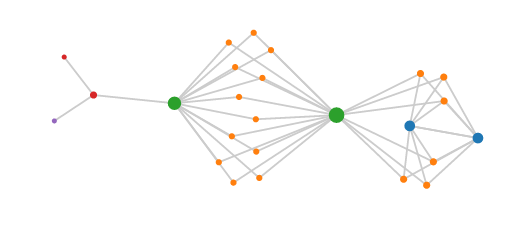
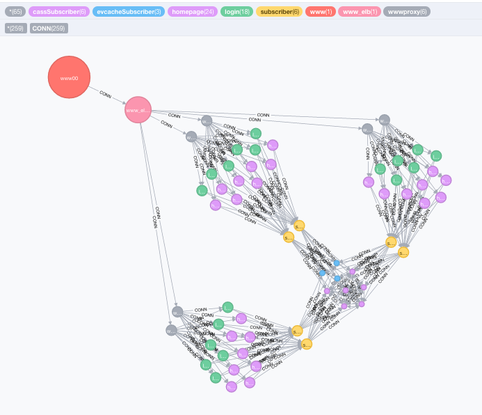

# spigo and simianviz

[](https://gitter.im/adrianco/spigo?utm_source=badge&utm_medium=badge&utm_campaign=pr-badge&utm_content=badge)

[](https://godoc.org/github.com/adrianco/spigo) 

[Wiki Instructions](https://github.com/adrianco/spigo/wiki)

SIMulate Interactive Actor Network VIsualiZation - simianviz - also
visualize the simian army in action. Follow [@simianviz on twitter](https://www.twitter.com/simianviz) to
get update notifications.

Originally called Simulate Protocol Interactions in Go - spigo - the name spigo is taken, however simianviz wasn't, so domains have been registered etc. and the name will transition over the coming months.

### Using simianviz to view architecture diagrams
[Launch the dependency graph visualization in your browser](http://simianviz.surge.sh/netflixoss)



For a local installation of the UI, with no network dependencies, you can start the service and browse localhost:8000 using:
```
$ cd ui
$ npm install
$ npm run dev
```

With a local install of the Neo4j graph database, you can write the graph into Neo4j with -n, and additionally write the flow data with -n -c. Subsections of the graph and flows can be viewed using Neo4j queries. The default local Neo4j instance is expected to be at localhost:7474, this can be overridden by setting NEO4JURL in the environment. The password must be set in the environment as well.
```
$ ./spigo -n
2016/05/21 08:50:51 Neo4j requires environment variable NEO4JPASSWORD is set
```


### Running the simulation to generate new visualizations and metrics

```
$ ./spigo -h
Usage of ./spigo:
  -a string
    	Architecture to create or read, fsm, migration, or read from json_arch/<arch>_arch.json (default "netflixoss")
  -c	Collect metrics and flows to json_metrics csv_metrics neo4j and via http: extvars
  -cpuprofile string
    	Write cpu profile to file
  -cpus int
    	Number of CPUs for Go runtime (default 4)
  -d int
    	Simulation duration in seconds (default 10)
  -f	Filter output names to simplify graph by collapsing instances to services
  -g	Enable GraphML logging of nodes and edges to gml/<arch>.graphml
  -j	Enable GraphJSON logging of nodes and edges to json/<arch>.json
  -kv string
    	Configuration key:value - chat:10ms sets default message insert rate
  -m	Enable console logging of every message
  -n	Enable Neo4j logging of nodes and edges
  -p int
    	Pirate population for fsm or scale factor % for other architectures (default 100)
  -r	Reload graph from json/<arch>.json to setup architecture
  -s int
    	Sequence number to create multiple runs for ui to step through in json/<arch><s>.json
  -u string
    	Polling interval for Eureka name service, increase for large populations (default "1s")
  -w int
    	Wide area regions to replicate architecture into, defaults based on 6 AWS region names (default 1)
```


### Developing new architectures and simulation features

There were too many top level packages so a more hierachical directory
structure was setup.

```
Directory structure
- spigo        # binary built for MacOS
- spigo.go     # main program
- actors       # go code for packaged behaviors
- tooling      # go support code
- ui           # visualization code using d3 and js
- misc         # scripts to run all tests and regenerate output
- json_arch    # architecture definition files
- json         # json dependency graph output
- json_metrics # flow, metrics and guesstimate output
- csv_metrics  # histograms saved as tables
- png          # images for readme
- archived     # old files and packages
- gml          # old graphml dependency graphs
```

The format of architecture definition files is described in [json_arch/README](json_arch)

Docker compose (v1 and default to version2) yaml files can be converted to architecture json by extracting the dependency tree. Some editing to set the right relative counts and actor packages will be needed.
```
$ cd compose2arch; go install

$ compose2arch -file myarch.yaml > json_arch/myarch.json
```

### Contributing and forking Spigo/SimianViz
Here's a [useful guide to managing forked go programs](http://code.openark.org/blog/development/forking-golang-repositories-on-github-and-managing-the-import-path) on github. Thanks to [Kurt](https://github.com/kkemple), [Priya](https://github.com/hubayirp) and [Henri](https://github.com/hvandenb) for their initial contributions and advice.

Ideas for future enhancements and interfaces have been accumulated as Issues, [please take a look there](https://github.com/adrianco/spigo/issues) and feel free to add your own comments and ideas, or go ahead and implement something.

### Next steps, papers and presentations
[See this paper for some Occam code](SkypeSim07.pdf) and results for the original version of this idea circa 2007.

The public launch was during a short keynote presentation at the March 2015 O'Reilly Software Architecture Conference: [Monitoring Microservices - A Challenge](
http://www.slideshare.net/adriancockcroft/software-architecture-monitoring-microservices-a-challenge) - 
[Video of the 10 minute talk](https://youtu.be/smEuX-Hq6RI)

Most of the microservices presentations on [Adrian's slideshare account](http://slideshare.net/adriancockcroft) discuss the current state of work.

The basic framework is in place, but more interesting behaviors, automonous running, and user input to control or stop the simulation haven't been added yet.

Next steps include connecting the output directly to the browser over a websocket so the dynamic behavior of the graph can be seen in real time. A lot of refactoring has cleaned up the code and structure in preparation for more interesting features.

Jason Brown's [list of interesting Gossip papers](http://softwarecarnival.blogspot.com/2014/07/gossip-papers.html) might contain something interesting to try and implement... 
