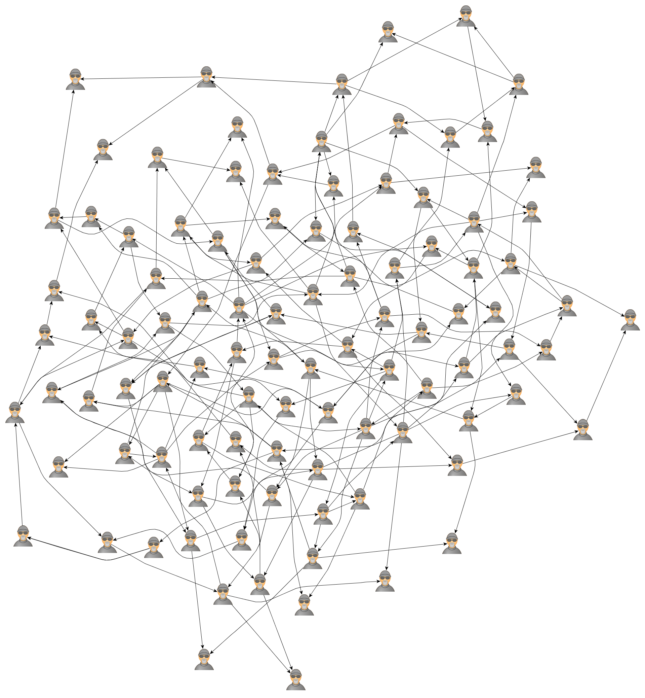

spigo
=====

Simulate Protocol Interactions in Go

Suitable for fairly large scale simulations, runs well up to 100,000 independent nodes (pirates). Each node is a goroutine, to create 100,000 pirates, send 500,000 messages and wait to shut them all down again takes about 1.5 seconds.

Uses a common message protocol called Gotocol which contains a channel of the same type. This allows message listener endpoints to be passed around to dynamically create an arbitrary interconnection network.

Using terminology from Promise Theory each message also has an Imposition code that tells the receiver how to interpret it, and an Intention body string that can be used as a simple string, or to encode a more complex structured type or a Promise.

There is a central controller, the FSM, and a number of independent Pirates who listen to the FSM and to each other.

Initial implementation creates the FSM and a default of 100 pirates, which can be set on the command line with -p=100. The FSM sends a Hello PirateNN message to name them which includes the FSM listener channel for back-chat. FSM then iterates through the pirates, telling each of them about two of their buddies at random to seed the network. FSM then sends a Goodbye message to each, the Pirate then quits and confirms by sending a Goodbye message back to the FSM.

Simulation is logged to a file spigo.graphml with the -g command line. The graphml format includes XML gibberish header followed by definitions of the node names and the edges that have formed between them. Graphml can be visualized using the yEd tool from yFiles. I'm looking for a browser based graph visualization that could show this in realtime.

There is a test program that exercises the Namedrop message, this is where the FSM or a Pirate passes on the name of a third party, and each Pirate builds up a buddy list of names and the listener channel for each buddy.

The basic framework is in place, but the interesting behaviors, automonous running, and user input to control or stop the simulation haven't been added yet. See the pdf for some Occam code and results for the original version of this circa 2007.

Jason's list of interesting Gossip papers might contain something interesting to try and implement... http://softwarecarnival.blogspot.com/2014/07/gossip-papers.html

Benchmark result
================
$ time spigo -p=100000
Spigo population 100000 pirates
Hello
Talk amongst yourselves
Go away
Pirate population: 0        
Exit

real	0m1.452s
user	0m1.056s
sys	0m0.317s

Up to about 200,000 pirates time is linear with count. Beyond that it slows down and with 1,000,000 initialization takes about 47s, and the process uses about 5GB RAM so there's probably an inefficiency in the way the map of names and channels is being created, or its taking a long time to steal 5GB RAM from other things on my 8GB RAM MacBook Air.

